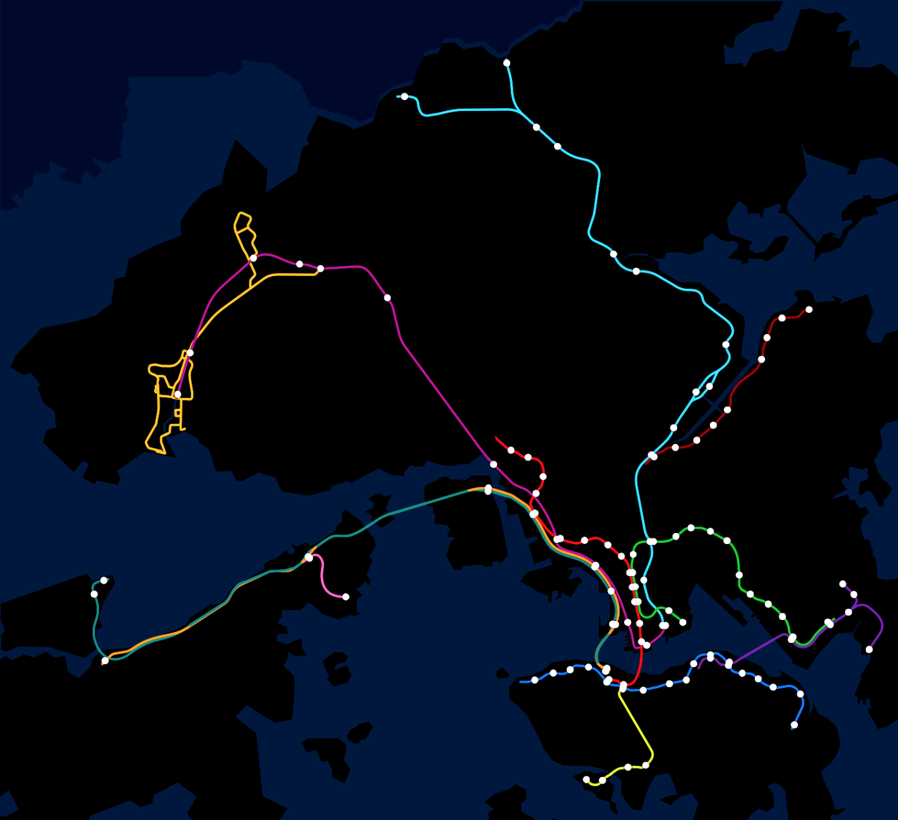
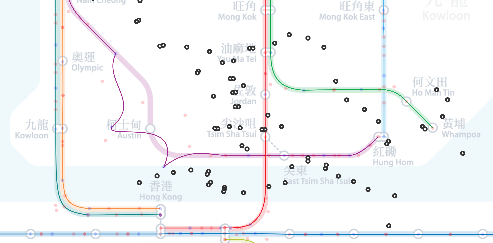
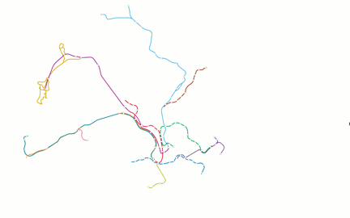

# Hong Kong MTR Map vs Real Geography

Posted on Reddit:
> After the amazing work on Berlin and Paris metros from u/vinnivinnivinni and u/hflake, I decided to create mine. Javascript based, D3 + some homemade morphing functions, on top of KUTE.js for the islands. Data for the true map from the SVG available on Wikipedia and manually for the stations and the MTR projected map

Output: (click for the animation)

<!---->

~200k views so far

# Code

Not the best code ever written for sure, but it was a one shot project, and I learnt so much on the way.

Run a local server  
`python -m http.server 8000`

Visit [localhost:8000/hk.html](localhost:8000/hk.html) for the final animation, all the other files in the repo are tools to create the animation.

I started with the SVG of Hong Kong MTR system (with real coordinates) from wikipedia, extracted key information (paths) and built a matching tool for the HK MTR plan available in station, generating the first `stations.csv`. To math SVG path with available paths open [localhost:8000/editor.html](localhost:8000/editor.html) and modify `editor.js`, it has a bunch of interesting functions:

- Auto Assign: Find the closest point for lines given real/plan stations coordinates
- Reassign what we can: Generate straight lines between points
- Change C in the middle: Reposition C of Bezier curves to be in the center of two points (red points between two blue dots)
- Transition: Animate it all
- Export is made by logging.

# Previous versions

# Press

As seen in BT and The Guardian.

